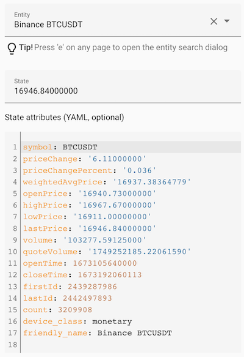
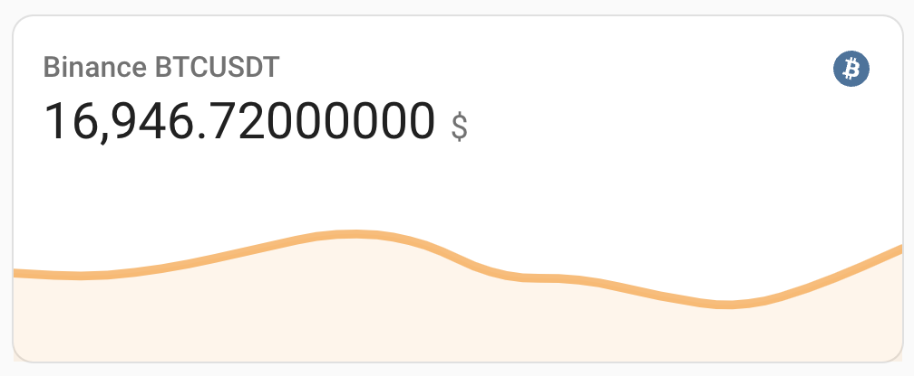

[](https://github.com/hacs/integration)
[](https://github.com/hacs/integration)

[](https://my.home-assistant.io/redirect/hacs_repository/?owner=Kartax&repository=home-assistant-binance&category=integration)


# Binance Integration for Home Assistant
A Home Assistant Integration for the cryptocurrency trading platform [Binance](https://www.binance.com/en).

Features:
 - [x] pull prices of a configurable list of currency pairs (e.g. BTCUSDT, XRPBTC...)
 - [x] additional attributes for each currency pair (priceChange, highPrice, lowPrice, volume, ...)
 - [x] optionally pull Spot wallet balances and total USD value (requires Binance API key & secret)
 - [x] optionally pull Simple Earn (flexible + locked) balances and total USD value (requires Binance API key & secret)

 


### Installation
I recommend to install this integration via HACS. Simply search for it\
or manually add this repository by using the "three-dots-menu" at the top right in HACS.


### Configuration
Configure the sensor(s) in ``configuration.yaml``.

#### Ticker only (no API key required)
```yaml
sensor:
  - platform: binance
    decimals: 8
    update_interval: 60
    symbols:
      - BTCUSDT
      - ETHUSDT
```

#### Ticker + Wallet + Earn (API key required)

When `api_key` and `api_secret` are present, the integration automatically creates a Spot wallet total
sensor and a Simple Earn total sensor. No extra flags needed.

Optionally add `wallet_assets` to also create per-asset Spot balance sensors, and `wallet_earn_assets`
to also create per-asset Earn sensors.

To use wallet features you need a Binance API key with **read permissions** (no trading permissions required).
Create one at [Binance API Management](https://www.binance.com/en/my/settings/api-management).

```yaml
sensor:
  - platform: binance
    symbols:
      - BTCUSDT
      - ETHUSDT
    api_key: !secret binance_api_key
    api_secret: !secret binance_api_secret
    wallet_assets:            # optional: per-asset Spot sensors
      - BTC
      - ETH
      - USDT
    wallet_earn_assets:       # optional: per-asset Earn sensors
      - USDT
      - BTC
```

`sensor.binance_wallet_total_usd` is always created when an API key is configured:

| Attribute | Description |
|-----------|-------------|
| `total_btc` | Sum of all asset BTC valuations |
| `btc_price_usd` | Current BTC/USDT price used for conversion |
| `asset_breakdown` | Dict of `asset -> btcValuation` for all non-zero assets |

The sensor **state** is the estimated total Spot wallet value in USD. Uses `POST /sapi/v3/asset/getUserAsset`.

Each `wallet_assets` entry additionally creates `sensor.binance_wallet_<ASSET>`:

| Attribute | Description |
|-----------|-------------|
| `free` | Available (spendable) balance |
| `locked` | Balance currently locked in open orders |
| `total` | `free` + `locked` |

The sensor **state** is the `free` balance. Unit of measurement is the asset symbol (e.g. `BTC`).

`sensor.binance_earn_total_usd` is always created when an API key is configured:

| Attribute | Description |
|-----------|-------------|
| `flexible_total_usd` | Sum of all flexible earn positions in USD |
| `locked_total_usd` | Sum of all locked earn positions in USD |
| `asset_breakdown` | Dict of `asset -> { flexible, locked, total_usd }` |

The sensor **state** is the combined earn value in USD (rounded to 2 decimals). Fetches all positions from
`GET /sapi/v1/simple-earn/flexible/position` and `GET /sapi/v1/simple-earn/locked/position`, then resolves
each asset to USD using `GET /api/v3/ticker/price`. USD-pegged stablecoins (USDT, USDC, BUSD, etc.) are
treated as 1.0 USD without a price lookup.

Each `wallet_earn_assets` entry additionally creates `sensor.binance_earn_<ASSET>`:

| Attribute | Description |
|-----------|-------------|
| `flexible_amount` | Amount held in flexible earn |
| `locked_amount` | Amount held in locked earn |
| `flexible_rewards` | Cumulative real-time rewards earned (flexible) |
| `locked_rewards` | Total reward amount (locked) |

The sensor **state** is `flexible_amount + locked_amount`. Unit of measurement is the asset symbol.

> **Security note:** Store your API credentials in `secrets.yaml` and reference them via `!secret`:
> ```yaml
> api_key: !secret binance_api_key
> api_secret: !secret binance_api_secret
> ```
