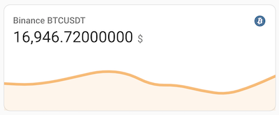

[](https://github.com/hacs/integration)


# Binance Integration for Home Assistant
A Home Assistant Integration for the cryptocurrency trading platform [Binance](https://www.binance.com/en).

Features:
 - [x] pull prices of a configurable list of currency pairs (e.g. BTCUSDT, XRPBTC...)
 - [x] additional attributes for each currency pair (priceChange, highPrice, lowPrice, volume, ...)
 - [ ] support configuration via the UI
 - [ ]  fetch personal account balance over secured api




### Installation
Manually add this repository by using the "three-dots-menu" at the top right in HACS.

### Configuration
Configure the sensor(s) in ``configuration.yaml``. 
```
sensor:
  - platform: binance
    symbols:
      - BTCUSDT
      - ETHUSDT
      - ...
```
